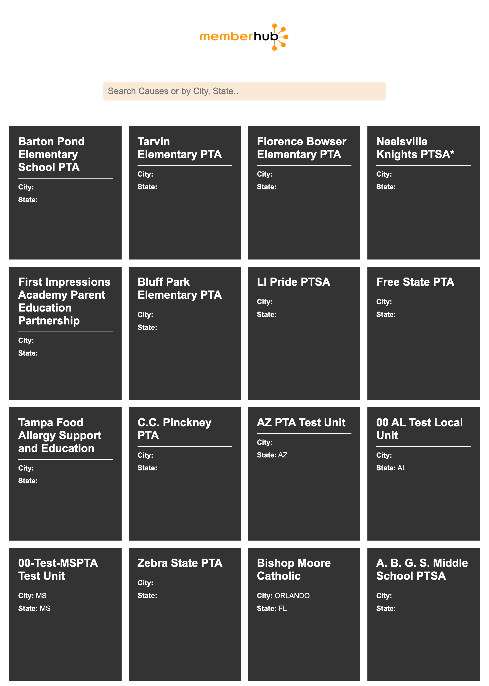

# Givebacks Skill Assessment

  ## Desciption 
  
  This application uses react.js and the Givebacks Cause Search API to display causes. When a user visits the website, they will view a list of all the causes from the API. The user will have the option to search for causes by name, city, and state. 
 
  ## Table of Contents
  - [Installation](#installation)
  - [Usage](#usage)
  - [Screenshot](#screenshot)
  - [Questions](#questions)
  - [Challenges](#Challenges)

  ## Installation 
  Clone repo, ```npm i```, run locally with ```npm start``` from root

  ## Usage 
  Open the browser to view the application on http://localhost:3000 
  Scroll through the website to view all of the Causes. Click on the search bar to search by name, city or state.
  
  ## Screenshot
  

  ## Questions 
  If you have any questions reach out to me at: </br>
  Github: https://github.com/Landonwilson1 </br>
  Email: Landonjwilson1@gmail.com
  
  ## Challenges
 Overall the project was mostly straightforward. I decided to challenge myself by using react.js to build the application. Using axios with react to fetch the data from the API took me a while to understand entirely. Once I was able to access all the data from the API the process became manageable. However, the data within the api was difficult to destructure. Having only some causes with data for City and State made it difficult to test. Lastly, I enjoyed the challenge of completing this project within a time limit. It was a true test of my knowledge on react and API’s. I was able to create a simple yet intriguing UI from the Givebacks Cause Search API with minimal loading times.
  
